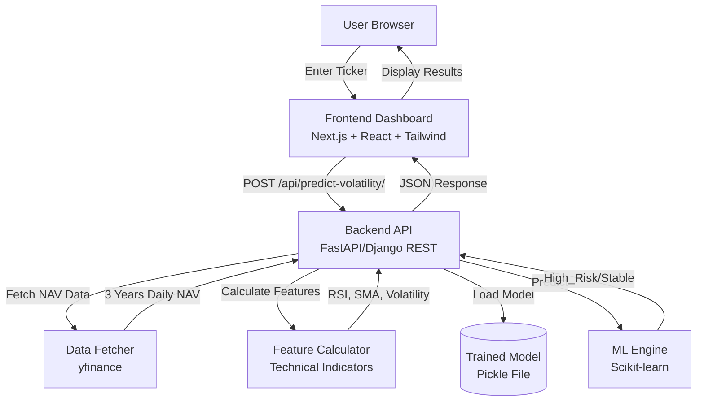
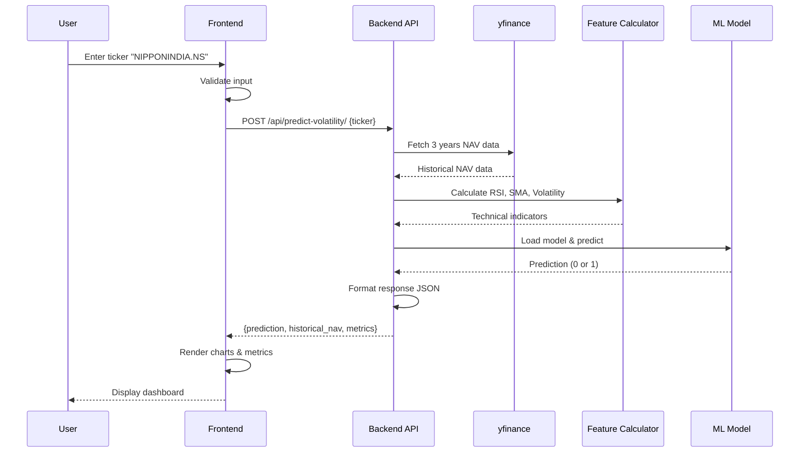
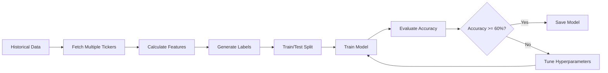
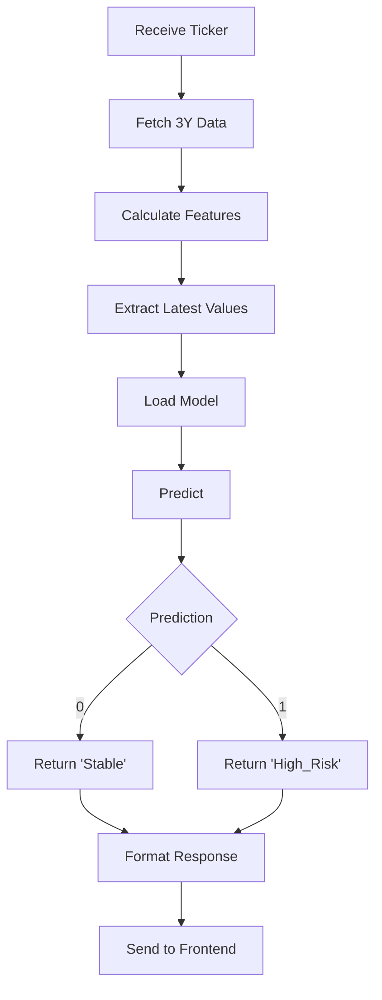

# Design Document: Mutual Fund Volatility & Trend Analyzer

## Overview

The Mutual Fund Volatility & Trend Analyzer is a full-stack web application that combines machine learning, financial data analysis, and interactive visualization to help users assess risk in Indian Small-Cap Mutual Funds. The system architecture follows a client-server model with clear separation between data fetching, ML processing, API services, and frontend presentation.

The application workflow:
1. User enters a mutual fund ticker symbol (e.g., "NIPPONINDIA.NS")
2. Backend fetches 3 years of historical NAV data via yfinance
3. System calculates technical indicators (RSI, SMA, Rolling Volatility)
4. ML model predicts volatility risk for next 15 days
5. Frontend displays prediction, metrics, and interactive charts

Key design principles:
- Separation of concerns between data fetching, feature engineering, ML prediction, and presentation
- Stateless API design for scalability
- Pre-trained model persistence to avoid retraining on each request
- Responsive UI with clear loading states and error handling

## Architecture

### High-Level System Architecture



### Technology Stack

**Backend:**
- **Framework**: FastAPI (preferred for async support and automatic OpenAPI docs) or Django REST Framework
- **ML Library**: Scikit-learn with Random Forest Classifier or XGBoost
- **Data Fetching**: yfinance library for Yahoo Finance API integration
- **Feature Engineering**: pandas, numpy for data manipulation
- **Model Persistence**: pickle or joblib for serializing trained models
- **Python Version**: 3.9+

**Frontend:**
- **Framework**: Next.js 14+ with App Router
- **UI Library**: React 18+
- **Styling**: Tailwind CSS
- **Charts**: Recharts (preferred for React integration) or Chart.js
- **HTTP Client**: fetch API or axios
- **TypeScript**: For type safety

**Development Tools:**
- **Backend Testing**: pytest, pytest-asyncio
- **Frontend Testing**: Jest, React Testing Library
- **API Documentation**: FastAPI auto-generated docs or Swagger for Django
- **Version Control**: Git

### Data Flow



## Components and Interfaces

### Backend Components

#### 1. Data Fetcher Component

**Responsibility**: Retrieve historical mutual fund NAV data from yfinance API

**Interface**:
```python
class DataFetcher:
    def fetch_nav_data(ticker: str, period: str = "3y") -> pd.DataFrame:
        """
        Fetch historical NAV data for a given ticker.
        
        Args:
            ticker: Mutual fund ticker symbol (e.g., "NIPPONINDIA.NS")
            period: Time period for historical data (default: "3y")
            
        Returns:
            DataFrame with columns: Date (index), Close (NAV values)
            
        Raises:
            TickerNotFoundError: If ticker is invalid
            DataSourceUnavailableError: If yfinance API fails
            TimeoutError: If request exceeds 10 seconds
        """
```

**Implementation Notes**:
- Use yfinance.Ticker(ticker).history(period="3y")
- Extract 'Close' prices as NAV values
- Implement 10-second timeout
- Handle network errors and invalid tickers gracefully

#### 2. Feature Calculator Component

**Responsibility**: Compute technical indicators from NAV data

**Interface**:
```python
class FeatureCalculator:
    def calculate_rsi(nav_series: pd.Series, period: int = 14) -> pd.Series:
        """Calculate 14-day Relative Strength Index."""
        
    def calculate_sma(nav_series: pd.Series, period: int = 50) -> pd.Series:
        """Calculate 50-day Simple Moving Average."""
        
    def calculate_rolling_volatility(nav_series: pd.Series, period: int = 30) -> pd.Series:
        """Calculate 30-day rolling standard deviation."""
        
    def calculate_all_features(nav_df: pd.DataFrame) -> pd.DataFrame:
        """
        Calculate all technical indicators.
        
        Args:
            nav_df: DataFrame with NAV values
            
        Returns:
            DataFrame with additional columns: RSI, SMA_50, Rolling_Volatility_30
            
        Notes:
            - Returns NaN for periods with insufficient data
            - RSI range: 0-100
            - SMA and volatility must be non-negative
        """
```

**Implementation Notes**:
- RSI calculation: Use standard formula with 14-day period
- SMA: Simple rolling mean over 50 days
- Rolling Volatility: Standard deviation over 30-day window
- Handle edge cases where data length < indicator period

#### 3. ML Engine Component

**Responsibility**: Train and persist ML model, make predictions

**Interface**:
```python
class MLEngine:
    def train_model(features_df: pd.DataFrame, labels: pd.Series) -> None:
        """
        Train Random Forest or XGBoost classifier.
        
        Args:
            features_df: DataFrame with RSI, SMA, Rolling_Volatility columns
            labels: Binary labels (1=High_Risk, 0=Stable)
            
        Notes:
            - Minimum accuracy threshold: 60%
            - Saves model to disk as 'volatility_model.pkl'
        """
        
    def load_model(model_path: str = "volatility_model.pkl") -> object:
        """Load pre-trained model from disk."""
        
    def predict_volatility(features: dict) -> int:
        """
        Predict volatility risk.
        
        Args:
            features: Dict with keys 'rsi', 'sma', 'rolling_volatility'
            
        Returns:
            0 for Stable, 1 for High_Risk
            
        Performance:
            Must complete within 2 seconds
        """
```

**Implementation Notes**:
- Use RandomForestClassifier or XGBClassifier
- Feature set: [RSI, SMA_50, Rolling_Volatility_30]
- Label generation: Calculate 15-day forward returns, label as 1 if drop > 2%
- Model persistence: Use joblib.dump/load for efficiency
- Training should be done offline, not on each request

#### 4. Backend API Component

**Responsibility**: Expose REST endpoint, orchestrate components, format responses

**FastAPI Implementation**:
```python
from fastapi import FastAPI, HTTPException
from pydantic import BaseModel

app = FastAPI()

class PredictionRequest(BaseModel):
    ticker: str

class PredictionResponse(BaseModel):
    prediction: str  # "Stable" or "High_Risk"
    historical_nav: list[dict]  # [{"date": "2024-01-01", "nav": 123.45}, ...]
    current_rsi: float
    current_volatility: float
    current_nav: float

@app.post("/api/predict-volatility/", response_model=PredictionResponse)
async def predict_volatility(request: PredictionRequest):
    """
    Predict mutual fund volatility risk.
    
    Process:
    1. Fetch 3 years NAV data via DataFetcher
    2. Calculate technical indicators via FeatureCalculator
    3. Load ML model and predict
    4. Format response with last 6 months data
    
    Timeout: 15 seconds total
    
    Errors:
        400: Invalid ticker format
        404: Ticker not found
        503: Data source unavailable
        500: Internal processing error
    """
```

**Django REST Framework Alternative**:
```python
from rest_framework.views import APIView
from rest_framework.response import Response
from rest_framework import status

class PredictVolatilityView(APIView):
    def post(self, request):
        # Similar implementation to FastAPI version
        pass
```

### Frontend Components

#### 1. Search Component

**Responsibility**: Accept ticker input and trigger prediction request

**Interface**:
```typescript
interface SearchComponentProps {
  onSearch: (ticker: string) => void;
  isLoading: boolean;
}

export function SearchComponent({ onSearch, isLoading }: SearchComponentProps) {
  // Input field for ticker
  // Submit button (disabled when loading)
  // Client-side validation (non-empty, trimmed)
}
```

#### 2. Metrics Dashboard Component

**Responsibility**: Display current NAV, RSI, and AI risk status

**Interface**:
```typescript
interface MetricCardProps {
  title: string;
  value: string | number;
  variant?: 'default' | 'success' | 'danger';
}

interface MetricsDashboardProps {
  currentNav: number;
  currentRsi: number;
  prediction: 'Stable' | 'High_Risk';
}

export function MetricsDashboard({ currentNav, currentRsi, prediction }: MetricsDashboardProps) {
  // Three metric cards
  // Green styling for Stable, red for High_Risk
}
```

#### 3. Chart Component

**Responsibility**: Render interactive NAV line chart with SMA overlay

**Interface**:
```typescript
interface ChartDataPoint {
  date: string;
  nav: number;
  sma?: number;
}

interface ChartComponentProps {
  data: ChartDataPoint[];
}

export function ChartComponent({ data }: ChartComponentProps) {
  // Recharts LineChart with two lines (NAV and SMA)
  // Tooltip on hover
  // Responsive sizing
}
```

#### 4. API Service Module

**Responsibility**: Handle HTTP communication with backend

**Interface**:
```typescript
interface PredictionRequest {
  ticker: string;
}

interface PredictionResponse {
  prediction: 'Stable' | 'High_Risk';
  historical_nav: Array<{ date: string; nav: number }>;
  current_rsi: number;
  current_volatility: number;
  current_nav: number;
}

export class ApiService {
  private baseUrl: string;
  
  async predictVolatility(ticker: string): Promise<PredictionResponse> {
    // POST to /api/predict-volatility/
    // Handle errors and throw typed exceptions
  }
}
```

#### 5. Main Page Component

**Responsibility**: Orchestrate all components, manage application state

**Interface**:
```typescript
export default function HomePage() {
  const [data, setData] = useState<PredictionResponse | null>(null);
  const [loading, setLoading] = useState(false);
  const [error, setError] = useState<string | null>(null);
  
  const handleSearch = async (ticker: string) => {
    // Set loading state
    // Call API service
    // Update data or error state
    // Clear loading state
  };
  
  // Render SearchComponent, MetricsDashboard, ChartComponent
  // Show loading spinner when loading
  // Show error message when error exists
}
```

## Data Models

### Backend Data Models

#### NAV Data Model
```python
# pandas DataFrame structure
{
    'Date': pd.DatetimeIndex,  # Trading dates
    'Close': float,            # NAV values
    'RSI': float,              # 14-day RSI (0-100)
    'SMA_50': float,           # 50-day moving average
    'Rolling_Volatility_30': float  # 30-day std dev
}
```

#### ML Training Data Model
```python
{
    'features': pd.DataFrame,  # Columns: RSI, SMA_50, Rolling_Volatility_30
    'labels': pd.Series,       # Binary: 0 (Stable) or 1 (High_Risk)
}

# Label generation logic:
# For each date t:
#   future_return = (NAV[t+15] - NAV[t]) / NAV[t]
#   label = 1 if future_return < -0.02 else 0
```

#### API Response Model
```python
{
    "prediction": str,  # "Stable" or "High_Risk"
    "historical_nav": [
        {"date": "YYYY-MM-DD", "nav": float},
        # Last 6 months of data
    ],
    "current_rsi": float,
    "current_volatility": float,
    "current_nav": float
}
```

### Frontend Data Models

#### TypeScript Interfaces
```typescript
interface HistoricalNavPoint {
  date: string;  // ISO date format
  nav: number;
}

interface PredictionData {
  prediction: 'Stable' | 'High_Risk';
  historicalNav: HistoricalNavPoint[];
  currentRsi: number;
  currentVolatility: number;
  currentNav: number;
}

interface ApiError {
  message: string;
  code: string;
}
```

### Database Schema

For this application, we use file-based model persistence rather than a traditional database. However, if we need to store historical predictions or user queries:

```sql
-- Optional: Prediction History Table
CREATE TABLE prediction_history (
    id SERIAL PRIMARY KEY,
    ticker VARCHAR(50) NOT NULL,
    prediction VARCHAR(20) NOT NULL,  -- 'Stable' or 'High_Risk'
    current_rsi FLOAT,
    current_volatility FLOAT,
    current_nav FLOAT,
    created_at TIMESTAMP DEFAULT CURRENT_TIMESTAMP
);

CREATE INDEX idx_ticker_created ON prediction_history(ticker, created_at);
```

**Note**: Database is optional for MVP. Model persistence uses pickle files stored on disk.

## Project Structure

### Backend Folder Structure

```
backend/
├── app/
│   ├── __init__.py
│   ├── main.py                 # FastAPI app initialization
│   ├── api/
│   │   ├── __init__.py
│   │   └── routes.py           # /api/predict-volatility/ endpoint
│   ├── services/
│   │   ├── __init__.py
│   │   ├── data_fetcher.py     # DataFetcher class
│   │   ├── feature_calculator.py  # FeatureCalculator class
│   │   └── ml_engine.py        # MLEngine class
│   ├── models/
│   │   ├── __init__.py
│   │   └── schemas.py          # Pydantic models
│   └── utils/
│       ├── __init__.py
│       └── exceptions.py       # Custom exceptions
├── models/
│   └── volatility_model.pkl    # Trained ML model
├── scripts/
│   └── train_model.py          # Offline model training script
├── tests/
│   ├── __init__.py
│   ├── test_data_fetcher.py
│   ├── test_feature_calculator.py
│   ├── test_ml_engine.py
│   └── test_api.py
├── requirements.txt
├── .env
└── README.md
```

### Frontend Folder Structure

```
frontend/
├── src/
│   ├── app/
│   │   ├── layout.tsx          # Root layout
│   │   ├── page.tsx            # Home page
│   │   └── globals.css         # Tailwind imports
│   ├── components/
│   │   ├── SearchComponent.tsx
│   │   ├── MetricsDashboard.tsx
│   │   ├── MetricCard.tsx
│   │   ├── ChartComponent.tsx
│   │   ├── LoadingSpinner.tsx
│   │   └── ErrorMessage.tsx
│   ├── services/
│   │   └── api.ts              # API service functions
│   ├── types/
│   │   └── index.ts            # TypeScript interfaces
│   └── utils/
│       └── formatters.ts       # Date/number formatting
├── public/
├── tests/
│   ├── components/
│   └── services/
├── package.json
├── tsconfig.json
├── tailwind.config.js
├── next.config.js
└── README.md
```

## ML Model Training Pipeline

### Training Workflow



### Training Script Outline

```python
# scripts/train_model.py

def prepare_training_data(tickers: list[str]) -> tuple:
    """
    Fetch data for multiple tickers and prepare training dataset.
    
    Steps:
    1. Fetch 3 years data for each ticker
    2. Calculate RSI, SMA, Rolling Volatility
    3. Calculate 15-day forward returns
    4. Label: 1 if return < -2%, else 0
    5. Drop NaN values
    6. Combine all tickers into single dataset
    """
    
def train_and_evaluate():
    """
    Train model and evaluate performance.
    
    Steps:
    1. Load training data
    2. Split into train/test (80/20)
    3. Train RandomForestClassifier
    4. Evaluate on test set
    5. Print classification report
    6. Save model if accuracy >= 60%
    """

# Example tickers for training
TRAINING_TICKERS = [
    "NIPPONINDIA.NS",
    "AXISSMALLCAP.NS",
    # Add more small-cap fund tickers
]

if __name__ == "__main__":
    train_and_evaluate()
```

### Model Configuration

```python
from sklearn.ensemble import RandomForestClassifier

model = RandomForestClassifier(
    n_estimators=100,
    max_depth=10,
    min_samples_split=5,
    random_state=42,
    class_weight='balanced'  # Handle class imbalance
)
```

### Feature Importance

After training, analyze which features contribute most to predictions:
- RSI: Momentum indicator
- Rolling Volatility: Direct measure of price fluctuation
- SMA: Trend indicator

## Prediction Workflow

### Runtime Prediction Process



### Prediction Code Flow

```python
async def predict_volatility(ticker: str) -> PredictionResponse:
    # 1. Fetch data (10s timeout)
    nav_df = data_fetcher.fetch_nav_data(ticker, period="3y")
    
    # 2. Calculate features
    features_df = feature_calculator.calculate_all_features(nav_df)
    
    # 3. Extract latest values (most recent non-NaN)
    latest_features = {
        'rsi': features_df['RSI'].dropna().iloc[-1],
        'sma': features_df['SMA_50'].dropna().iloc[-1],
        'rolling_volatility': features_df['Rolling_Volatility_30'].dropna().iloc[-1]
    }
    
    # 4. Load model and predict (2s timeout)
    model = ml_engine.load_model()
    prediction_int = ml_engine.predict_volatility(latest_features)
    
    # 5. Map to string
    prediction_str = "High_Risk" if prediction_int == 1 else "Stable"
    
    # 6. Format response with last 6 months data
    six_months_ago = datetime.now() - timedelta(days=180)
    recent_data = nav_df[nav_df.index >= six_months_ago]
    
    return PredictionResponse(
        prediction=prediction_str,
        historical_nav=[
            {"date": date.isoformat(), "nav": row['Close']}
            for date, row in recent_data.iterrows()
        ],
        current_rsi=latest_features['rsi'],
        current_volatility=latest_features['rolling_volatility'],
        current_nav=nav_df['Close'].iloc[-1]
    )
```


## Error Handling

### Backend Error Handling Strategy

**Error Categories**:

1. **Data Fetching Errors**
   - Invalid ticker symbol → 404 Not Found
   - yfinance API unavailable → 503 Service Unavailable
   - Timeout (>10s) → 504 Gateway Timeout

2. **Feature Calculation Errors**
   - Insufficient data for indicators → Return partial data with NaN values
   - Invalid NAV values (negative, NaN) → 400 Bad Request

3. **ML Model Errors**
   - Model file not found → 500 Internal Server Error
   - Prediction failure → 500 Internal Server Error
   - Invalid feature values → 400 Bad Request

4. **General Errors**
   - Request timeout (>15s) → 504 Gateway Timeout
   - Unexpected exceptions → 500 Internal Server Error

**Error Response Format**:
```json
{
  "error": {
    "code": "TICKER_NOT_FOUND",
    "message": "The ticker symbol 'INVALID.NS' was not found. Please verify the ticker symbol.",
    "details": null
  }
}
```

**Error Codes**:
- `TICKER_NOT_FOUND`: Invalid ticker symbol
- `DATA_SOURCE_UNAVAILABLE`: yfinance API failure
- `INSUFFICIENT_DATA`: Not enough historical data for analysis
- `MODEL_ERROR`: ML model prediction failure
- `TIMEOUT`: Request exceeded time limit
- `INTERNAL_ERROR`: Unexpected server error

### Frontend Error Handling Strategy

**Error Display**:
- Toast notifications for transient errors
- Inline error messages for validation errors
- Error boundary for unexpected React errors
- Retry button for recoverable errors

**Error Messages**:
- User-friendly language (avoid technical jargon)
- Actionable guidance (e.g., "Please verify the ticker symbol")
- Clear indication of error type (data source, network, validation)

**Error Recovery**:
- Automatic retry for network failures (with exponential backoff)
- Manual retry button for user-initiated retry
- Clear error state without losing user input
- Graceful degradation (show partial data if available)

### Logging and Monitoring

**Backend Logging**:
- Log all API requests with ticker and timestamp
- Log errors with full stack traces
- Log model predictions for audit trail
- Use structured logging (JSON format)

**Frontend Logging**:
- Log API errors to console (development)
- Send critical errors to monitoring service (production)
- Track user interactions for analytics

## Testing Strategy

### Dual Testing Approach

This application requires both unit testing and property-based testing for comprehensive coverage:

**Unit Tests**: Focus on specific examples, edge cases, and integration points
- Concrete examples with known inputs/outputs
- Edge cases (empty data, boundary values)
- Error conditions and exception handling
- Component integration tests

**Property-Based Tests**: Verify universal properties across all inputs
- Generate random valid inputs to test general correctness
- Verify invariants that must hold for all cases
- Test mathematical properties (ranges, relationships)
- Minimum 100 iterations per property test

Together, these approaches provide comprehensive coverage: unit tests catch concrete bugs and verify specific behaviors, while property tests verify general correctness across the input space.

### Backend Testing

**Testing Framework**: pytest with pytest-asyncio for async tests

**Property-Based Testing Library**: Hypothesis (Python)

**Test Categories**:

1. **Data Fetcher Tests**
   - Unit: Test with known ticker symbols
   - Unit: Test error handling for invalid tickers
   - Unit: Test timeout behavior
   - Property: Verify data structure for any valid ticker

2. **Feature Calculator Tests**
   - Unit: Test RSI calculation with known values
   - Unit: Test edge cases (insufficient data)
   - Property: Verify RSI range (0-100) for any NAV data
   - Property: Verify SMA and volatility are non-negative
   - Property: Verify all indicators calculated for sufficient data

3. **ML Engine Tests**
   - Unit: Test model loading
   - Unit: Test prediction with known features
   - Property: Verify model persistence (save/load round-trip)
   - Property: Verify prediction output is always 0 or 1
   - Property: Verify label generation logic

4. **API Tests**
   - Unit: Test endpoint exists and accepts POST
   - Unit: Test specific error cases
   - Property: Verify response structure for any valid ticker
   - Property: Verify error responses for any invalid input
   - Integration: Test full request-response cycle

**Property Test Configuration**:
Each property test must:
- Run minimum 100 iterations
- Include a comment tag referencing the design property
- Tag format: `# Feature: mutual-fund-volatility-analyzer, Property {number}: {property_text}`

**Example Property Test**:
```python
from hypothesis import given, strategies as st
import pytest

# Feature: mutual-fund-volatility-analyzer, Property 1: RSI range invariant
@given(nav_data=st.lists(st.floats(min_value=1.0, max_value=1000.0), min_size=20))
@pytest.mark.parametrize("_", range(100))
def test_rsi_range_invariant(nav_data, _):
    """For any NAV data series, computed RSI values must be in range [0, 100]."""
    calculator = FeatureCalculator()
    rsi_series = calculator.calculate_rsi(pd.Series(nav_data))
    
    # Drop NaN values from initial period
    valid_rsi = rsi_series.dropna()
    
    assert all(0 <= rsi <= 100 for rsi in valid_rsi), \
        f"RSI values outside valid range: {valid_rsi.tolist()}"
```

### Frontend Testing

**Testing Framework**: Jest with React Testing Library

**Property-Based Testing Library**: fast-check (JavaScript/TypeScript)

**Test Categories**:

1. **Component Tests**
   - Unit: Test SearchComponent renders and accepts input
   - Unit: Test MetricsDashboard displays correct values
   - Unit: Test ChartComponent renders with data
   - Unit: Test error message display
   - Unit: Test loading state display

2. **API Service Tests**
   - Unit: Test API function calls correct endpoint
   - Unit: Test request formatting
   - Property: Verify response parsing for any valid JSON
   - Property: Verify error propagation for any error response

3. **Integration Tests**
   - Test full user flow: search → loading → results
   - Test error flow: search → error → retry
   - Test input validation

**Property Test Configuration**:
Each property test must:
- Run minimum 100 iterations
- Include a comment tag referencing the design property
- Tag format: `// Feature: mutual-fund-volatility-analyzer, Property {number}: {property_text}`

**Example Property Test**:
```typescript
import fc from 'fast-check';

// Feature: mutual-fund-volatility-analyzer, Property 5: Input trimming
test('ticker input is trimmed before submission', () => {
  fc.assert(
    fc.property(
      fc.string().filter(s => s.trim().length > 0),
      fc.array(fc.constantFrom(' ', '\t', '\n'), { minLength: 0, maxLength: 5 }),
      fc.array(fc.constantFrom(' ', '\t', '\n'), { minLength: 0, maxLength: 5 }),
      (ticker, prefixWhitespace, suffixWhitespace) => {
        const input = prefixWhitespace.join('') + ticker + suffixWhitespace.join('');
        const trimmed = input.trim();
        
        // Verify trimming behavior
        expect(trimmed).toBe(ticker.trim());
        expect(trimmed).not.toContain(/^\s/);
        expect(trimmed).not.toContain(/\s$/);
      }
    ),
    { numRuns: 100 }
  );
});
```

### Test Coverage Goals

- Backend: Minimum 80% code coverage
- Frontend: Minimum 75% code coverage
- All critical paths must have both unit and property tests
- All error handling paths must be tested

### Manual Testing Checklist

- [ ] Test with multiple real mutual fund tickers
- [ ] Verify chart interactivity (hover, zoom)
- [ ] Test on different screen sizes (responsive design)
- [ ] Test with slow network conditions
- [ ] Verify error messages are user-friendly
- [ ] Test accessibility (keyboard navigation, screen readers)
- [ ] Verify loading states are visible
- [ ] Test retry mechanism after failures


## Correctness Properties

*A property is a characteristic or behavior that should hold true across all valid executions of a system—essentially, a formal statement about what the system should do. Properties serve as the bridge between human-readable specifications and machine-verifiable correctness guarantees.*

### Property 1: Valid ticker data retrieval completeness

*For any* valid ticker symbol, when the Data Fetcher successfully retrieves data, the returned DataFrame must contain a date index and NAV values for approximately 3 years of trading days (between 700-800 data points).

**Validates: Requirements 1.1, 1.2**

### Property 2: Invalid ticker error handling

*For any* invalid or malformed ticker symbol, the Data Fetcher must return an error indicating the ticker was not found, without throwing unhandled exceptions.

**Validates: Requirements 1.4**

### Property 3: Technical indicator calculation completeness

*For any* NAV data series with sufficient length, the Feature Calculator must compute RSI, SMA, and Rolling Volatility for all applicable data points (after the initial period required for each indicator).

**Validates: Requirements 2.1, 2.2, 2.3**

### Property 4: Technical indicator range invariants

*For any* NAV data series, all computed technical indicators must satisfy their mathematical constraints: RSI values must be in range [0, 100], SMA values must be positive, and Rolling Volatility values must be non-negative.

**Validates: Requirements 2.5**

### Property 5: Label generation correctness

*For any* historical NAV data point with 15 days of future data available, the labeling function must assign label "1" (High_Risk) if and only if the 15-day forward return is less than -2%, otherwise label "0" (Stable).

**Validates: Requirements 3.3**

### Property 6: Model persistence round-trip

*For any* trained ML model, saving the model to disk and then loading it must produce a model that generates identical predictions for the same input features.

**Validates: Requirements 3.5**

### Property 7: Prediction output validity

*For any* valid feature set (RSI, SMA, Rolling Volatility), the Prediction Model must output exactly one of two values: 0 or 1, representing Stable or High_Risk respectively.

**Validates: Requirements 4.1, 4.2**

### Property 8: API response structure completeness

*For any* successful prediction request with a valid ticker, the Backend API response must include all required fields: "prediction" (with value "Stable" or "High_Risk"), "historical_nav" (array of date-NAV pairs), "current_rsi", "current_volatility", and "current_nav".

**Validates: Requirements 5.3, 6.1, 6.2, 6.3, 6.4, 6.5**

### Property 9: API error response consistency

*For any* failed prediction request (invalid ticker, API failure, timeout, etc.), the Backend API must return an HTTP error status code (4xx or 5xx) with a JSON response containing an error message, without returning a 200 status code.

**Validates: Requirements 5.4**

### Property 10: Frontend error display

*For any* error response from the Backend API, the Frontend Dashboard must display a user-friendly error message to the user, not a raw error object or technical stack trace.

**Validates: Requirements 10.1**

### Property 11: Input sanitization

*For any* ticker symbol input with leading or trailing whitespace, the Frontend Dashboard must trim the whitespace before submitting the request to the Backend API.

**Validates: Requirements 11.5**

### Property 12: API service response parsing

*For any* valid JSON response from the Backend API, the API service module must successfully parse it into the correct TypeScript data structure without throwing parsing errors.

**Validates: Requirements 12.4**

### Property 13: API service error propagation

*For any* error response (network failure, HTTP error, timeout), the API service module must propagate the error to calling components in a structured format that allows appropriate error handling.

**Validates: Requirements 12.5**

